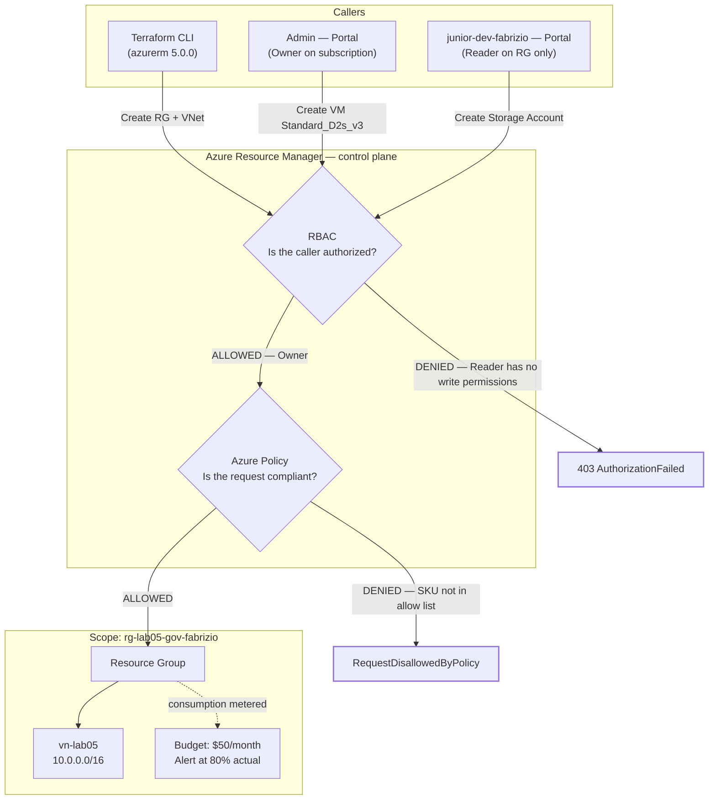

Governance & Security Hardening on Azure

**Author:** Fabrizio Mastrogiovanni
**Cost:** $0 — no billable resources are deployed
**Deployment method:** Resource Group and VNet provisioned with **Terraform**; governance controls applied via portal

---

## 1. Objective

Move from being the subscription Owner who can do anything, to being the administrator who defines what *everyone else* can do.

This lab proves three independent control layers on the same Resource Group:

| Layer | Question it answers | Mechanism |
|---|---|---|
| **Identity / RBAC** | *Is this caller allowed to perform this action?* | Reader role assignment on the RG |
| **Governance / Policy** | *Is this request compliant, regardless of who sent it?* | `Allowed virtual machine size SKUs` policy |
| **Cost** | *Are we spending more than we agreed to?* | Budget with an 80% actual-spend alert |

The deliverable is three explicit "denied" or "alerted" outcomes — not three resources created.

---

## 2. Architecture

Every request to Azure — portal click, CLI command, Terraform apply — goes through the same front door: **Azure Resource Manager (ARM)**. RBAC and Policy are both enforced there, which is why neither can be bypassed by switching tools.



**The key structural point:** RBAC and Policy are evaluated in that order, and they are not redundant. RBAC answers *who*; Policy answers *what*. An Owner passes RBAC and can still be stopped by Policy. That's the entire reason both exist.

**Why Terraform is drawn as a peer of the portal, not a side door:** it authenticates with the same Entra ID identity and submits the same ARM requests. If the Policy assignment in Phase 4 were in place before a non-compliant `terraform apply`, Terraform would fail with the same `RequestDisallowedByPolicy` — surfaced as an apply error instead of a red banner. IaC does not sit outside governance.

<!-- SCREENSHOT: overall resource group overview after setup -->


---

## 3. Prerequisites

- Active Azure subscription with **Owner** or **User Access Administrator** rights (needed to create role assignments)
- Permission to create users in Microsoft Entra ID
- A browser that supports Incognito / Private mode — you need two identities signed in at once
- Azure CLI installed and authenticated (`az login`)
- Terraform installed (`terraform -version`) — this lab was built against the **azurerm provider v5.0.0**
- Your subscription ID: `az account show --query id -o tsv`

---

## 4. Naming Convention

| Item | Value |
|---|---|
| Resource Group | `rg-lab05-gov-fabrizio` |
| Virtual Network | `vn-lab05` (`10.0.0.0/16`) |
| Region | East US |
| Working directory | `Governance-Security-Hardening5/` |
| Test user | `junior-dev-fabrizio@<yourtenant>.onmicrosoft.com` |
| Policy assignment | `Restrict-VM-Sizes` |
| Budget | `Monthly-Lab-Budget` |
| Allowed VM SKUs | `Standard_B1s`, `Standard_B1ms` |

---

## 5. Phase 1 — Provision the Scope with Terraform

All three controls in this lab are scoped to a single Resource Group. Scoping matters: a policy applied at subscription level would affect every future lab.

The lab as written builds this in the portal. I built it with Terraform instead — carrying forward the IaC work from Lab 04 and giving the Reader identity in Phase 3 something real to look at rather than an empty group.

### 5.1 `provider.tf`

```hcl
terraform {
  required_providers {
    azurerm = {
      source  = "hashicorp/azurerm"
      version = "=5.0.0"
    }
  }
}

# Configure the Microsoft Azure Provider
provider "azurerm" {
  subscription_id = "<your-subscription-id>"
  features {}
}
```

> **azurerm v4.0 onward requires `subscription_id` explicitly** — it no longer falls back silently to the CLI's active subscription. Rather than hardcoding it, export it instead and delete the line:
> ```bash
> export ARM_SUBSCRIPTION_ID=$(az account show --query id -o tsv)
> ```
> The provider reads `ARM_SUBSCRIPTION_ID` automatically. This keeps a tenant-identifying value out of the repo.

<!-- SCREENSHOT: provider.tf in VS Code -->


### 5.2 `main.tf`

```hcl
resource "azurerm_resource_group" "example" {
  name     = "rg-lab05-gov-fabrizio"
  location = "East US"
}

# Create a virtual network within the resource group
resource "azurerm_virtual_network" "example" {
  name                = "vn-lab05"
  resource_group_name = azurerm_resource_group.example.name
  location            = azurerm_resource_group.example.location
  address_space       = ["10.0.0.0/16"]
}
```

Referencing `azurerm_resource_group.example.name` rather than retyping the string is what creates the implicit dependency graph — Terraform will create the RG first and destroy it last without being told to.

<!-- SCREENSHOT: main.tf in VS Code -->


### 5.3 Deploy

```bash
cd Governance-Security-Hardening5
pwd          # confirm you are in the lab directory before anything else

terraform init
terraform plan
terraform apply
```

Expected tail of the apply:

```
Plan: 2 to add, 0 to change, 2 to destroy.

Do you want to perform these actions?
  Enter a value: yes

azurerm_resource_group.example: Creation complete after 27s
azurerm_virtual_network.example: Creation complete after 4s

Apply complete! Resources: 2 added, 0 changed, 2 destroyed.
```

<!-- SCREENSHOT: terraform apply output showing Apply complete -->


> **The `2 destroyed` in my output was not a mistake — it was a rename.** I initially deployed as `rg-lab05`, then changed the `name` attribute to `rg-lab05-gov-fabrizio`. A Resource Group name is a **ForceNew** attribute: it cannot be updated in place, so Terraform destroys and recreates. The VNet went with it, because it depends on the RG. Always read the plan header — `2 to add, 2 to destroy` on what looks like a cosmetic edit is the provider telling you it's replacing infrastructure, not editing it.

### 5.4 Confirm

```bash
terraform state list
az group show --name rg-lab05-gov-fabrizio --query "{name:name, location:location, state:properties.provisioningState}" -o table
```

### 5.5 Before your first commit

The state file records every resource attribute, including your subscription ID. Confirm it is ignored:

```bash
git check-ignore -v terraform.tfstate
```

If that returns nothing, the file is untracked but **not** ignored, and the next `git add .` will commit it. Add to `.gitignore`:

```gitignore
**/.terraform/*
*.tfstate
*.tfstate.*
*.tfvars
```

Commit `.terraform.lock.hcl` — it pins provider versions and belongs in the repo.

<!-- SCREENSHOT: resource group in portal after terraform apply -->


---

## 6. Phase 2 — RBAC: Assign Least Privilege

### 6.1 Create the test identity

**Portal:** search **Microsoft Entra ID** → **Users** → **New user** → **Create new user**

- User principal name: `junior-dev-fabrizio`
- Display name: `Junior Developer`
- Password: uncheck **Auto-generate**, set one you'll remember (you'll type it in Incognito shortly)
- **Review + create** → **Create**

> Note the full UPN including the `@<tenant>.onmicrosoft.com` suffix. You need it to sign in.

<!-- SCREENSHOT: new user creation in Entra ID -->


### 6.2 Grant Reader on the Resource Group

**Portal:** Resource groups → `rg-lab05-gov-fabrizio` → **Access control (IAM)** → **+ Add** → **Add role assignment**

- Role: **Reader** → **Next**
- Members: **+ Select members** → search `Junior Developer` → select → **Select**
- **Review + assign** → **Review + assign**

<!-- SCREENSHOT: role assignment confirmation on IAM blade -->


**Why Reader:** it grants read on all resource types in scope and write on none. It is the smallest role that still lets someone see the environment — the correct default for anyone who doesn't need to change things.

---

## 7. Phase 3 — Validate RBAC (Assertion 1)

The assignment only means something if you can demonstrate the denial.

1. Open an **Incognito / Private window** → `portal.azure.com`
2. Sign in as `junior-dev-fabrizio@<yourtenant>.onmicrosoft.com`
3. Navigate to **Resource groups** → `rg-lab05-gov-fabrizio`
   - ✅ The group is **visible**, and so is `vn-lab05` including its `10.0.0.0/16` address space — Reader grants full read on resource configuration, not just the ability to see that something exists
4. Click **+ Create** → search **Storage Account** → attempt to create one

**Expected result:**

```
The client 'junior-dev-fabrizio@<tenant>.onmicrosoft.com' with object id '<guid>'
does not have authorization to perform action
'Microsoft.Storage/storageAccounts/write' over scope
'/subscriptions/<sub-id>/resourceGroups/rg-lab05-gov-fabrizio'
```

The Create button may also render disabled, depending on where in the flow validation fires.

<!-- SCREENSHOT: authorization failed banner as junior-dev -->


**Assertion 1 satisfied:** the identity can read the scope and cannot write to it.

Close the Incognito window and return to your admin session.

**Optional CLI verification (as admin):**

```bash
az role assignment list \
  --resource-group rg-lab05-gov-fabrizio \
  --output table
```

Expected: a row with `Reader` and the Junior Developer principal, scoped to the RG — not the subscription.

---

## 8. Phase 4 — Azure Policy: Constrain What Can Be Built

RBAC restricts *people*. Policy restricts *requests*, including your own.

**Portal:** search **Policy** → **Authoring** → **Assignments** → **Assign policy**

**Basics**
- Scope: click **…** → select your subscription → select **`rg-lab05-gov-fabrizio`** as the Resource Group → **Select**
- Policy definition: click **…** → search `Allowed virtual machine size SKUs` → select
- Assignment name: `Restrict-VM-Sizes`

**Parameters**
- Uncheck **Only show parameters that need input**
- Allowed Size SKUs: select **only** `Standard_B1s` and `Standard_B1ms`

**Review + create** → **Create**

<!-- SCREENSHOT: policy assignment parameters showing allowed SKUs -->


> ⏱️ **Propagation delay:** assignments take roughly 10–30 minutes to become enforceable. If your test in Phase 5 succeeds when it should fail, the policy hasn't replicated yet — wait, don't rebuild it.

---

## 9. Phase 5 — Validate Policy (Assertion 2)

Run this test as **your admin account**. That's the point of the test.

**Portal:** `rg-lab05-gov-fabrizio` → **Create** → **Virtual machine**

- Name: `vm-policy-test`
- Image: Ubuntu Server
- Size: change to **`Standard_D2s_v3`** (anything outside the allow list)
- **Review + create**

**Expected result:** `Validation failed`. Expand the error:

```
Resource 'vm-policy-test' was disallowed by policy.
Policy assignment: Restrict-VM-Sizes
Policy definition: Allowed virtual machine size SKUs
Code: RequestDisallowedByPolicy
```

<!-- SCREENSHOT: validation failed with RequestDisallowedByPolicy -->


**Assertion 2 satisfied:** a subscription Owner was blocked by a governance control. This is the difference between a permission and a guardrail.

Do **not** complete the VM creation. Discard the form.

**Optional CLI verification:**

```bash
az policy assignment list \
  --scope "/subscriptions/$(az account show --query id -o tsv)/resourceGroups/rg-lab05-gov-fabrizio" \
  --output table
```

---

## 10. Phase 6 — Budget & Cost Alerting (Assertion 3)

RBAC and Policy are preventive. Budgets are **detective** — they don't stop spend, they tell you it happened.

**Portal:** `rg-lab05-gov-fabrizio` → **Budgets** (under Cost Management) → **+ Add**

**Budget details**
- Name: `Monthly-Lab-Budget`
- Reset period: **Billing month**
- Creation date: today
- Expiration date: one year out
- Amount: **50** (USD)
- **Next**

**Set alerts**
- Alert condition type: **Actual**
- % of budget: **80**
- Alert recipients: `growtonicconsulting@gmail.com`
- **Create**

<!-- SCREENSHOT: budget configuration and alert threshold -->


**Assertion 3 satisfied:** an alert fires at $40 of a $50 monthly ceiling.

> **Actual vs. Forecasted:** *Actual* alerts on money already spent. *Forecasted* alerts when Azure projects you'll breach the threshold before the period ends. Forecasted gives you earlier warning; actual gives you fewer false positives. For a lab budget, actual is correct.

---

## 11. Troubleshooting

| Symptom | Cause | Fix |
|---|---|---|
| Junior Dev can still create resources | Reader was assigned at subscription scope, or an inherited role grants write | Check **IAM → Role assignments**, filter by the user, and confirm the **Scope** column reads the Resource Group. Inherited assignments show as "Inherited" |
| Junior Dev sees nothing at all | Role assignment hasn't propagated (usually under 5 min) | Sign out and back in to refresh the token — RBAC changes aren't reflected in an already-issued token |
| Policy didn't block the VM | Assignment hasn't replicated | Wait 15–30 min. Confirm the assignment scope matches the RG you're deploying into |
| Policy blocks everything, including B1s | Parameter saved with an empty or wrong allow list | Open the assignment → **Edit assignment** → **Parameters** → confirm both SKUs are present |
| Can't create a role assignment | You're Contributor, not Owner / User Access Administrator | Contributor can manage resources but cannot grant access — that separation is deliberate |
| Can't find Budgets on the RG | Cost Management is subscription-scoped in some tenants | Create at subscription scope and filter by resource group |

---

## 12. Cleanup

Tear down in reverse order of creation. The policy assignment and budget were created outside Terraform, so they are not in state — remove them first, or `terraform destroy` will leave orphaned assignments pointing at a scope that no longer exists.

```bash
# 1. Remove the policy assignment (created in the portal, not tracked by Terraform)
az policy assignment delete \
  --name Restrict-VM-Sizes \
  --scope "/subscriptions/$(az account show --query id -o tsv)/resourceGroups/rg-lab05-gov-fabrizio"

# 2. Destroy the Terraform-managed infrastructure
cd Governance-Security-Hardening5
terraform destroy

# 3. Confirm state is empty
terraform state list          # returns nothing
az group exists --name rg-lab05-gov-fabrizio   # false
```

Expected: `Destroy complete! Resources: 2 destroyed.`

Then delete the test identity — it does not live in the Resource Group and will not be removed with it:

**Portal:** Microsoft Entra ID → **Users** → `Junior Developer` → **Delete**

> Deleted Entra ID users sit in a recoverable state for 30 days under **Deleted users**. Purge from there if you want the directory fully clean.

---

## 13. What I Learned

**RBAC and Policy answer different questions, and the order matters.**
A request is authorized first, then evaluated for compliance. Being Owner gets you past step one and tells you nothing about step two. This is the same structural pattern as NSG evaluation from Lab 02 — a control is only meaningful if you can name the specific request it rejects. "I have a policy" is not a boundary. "An Owner attempting a D-series VM in this RG receives `RequestDisallowedByPolicy`" is.

**Scope is the most consequential field on the form.**
The identical policy definition assigned at subscription scope instead of RG scope would have blocked VM creation across every lab in this repo. Nothing in the UI flags that difference; it's a dropdown that looks like every other dropdown.

**Preventive and detective controls are not substitutes.**
Policy prevents a class of resource from existing. A budget detects spend after the fact. Neither covers the other's failure mode: a policy allowing `Standard_B1s` still permits fifty of them, and a budget alert arrives after the money is gone.

**Propagation delay is a real operational property, not a bug.**
Both RBAC and Policy are eventually consistent. Testing too early produces a false negative that looks exactly like a misconfiguration — and the instinct to rebuild the assignment makes it worse. Read the timestamp before rebuilding anything.

**Contributor cannot grant access.**
Managing resources and managing who can manage resources are separate privileges by design. That separation is what stops a compromised Contributor from escalating to Owner.

**Renaming in Terraform is replacement, not editing.**
Changing `name` on a Resource Group produced `2 to add, 0 to change, 2 to destroy` — a ForceNew attribute triggers destroy-and-recreate, and everything depending on it goes too. On an empty lab RG that costs 30 seconds. On a group holding a database, it's an outage. The plan output said so before I typed `yes`; the discipline is reading the header, not trusting that a small edit implies a small change.

**IaC is subject to the same governance as the portal.**
The instinct is to think of Terraform as a privileged back channel. It isn't — it authenticates as an Entra ID identity and submits ARM requests like any other client. Had I applied the SKU policy before running `terraform apply` on a D-series VM, the apply would have failed with the same `RequestDisallowedByPolicy`. This is the practical consequence of the architecture diagram: enforcement lives at ARM, so there is no tool you can switch to in order to escape it.

**State files are a disclosure risk, not just a merge-conflict nuisance.**
`terraform.tfstate` contains the subscription ID and full resource metadata in plaintext. In my working tree the state files showed as untracked rather than ignored — one `git add .` away from being published. `git check-ignore -v terraform.tfstate` is a five-second check that belongs before the first commit of every lab, not after.

---

## 14. Video Walkthrough Script

> Target length: 8–10 minutes. Narration in plain text, actions in bold.

**[0:00 — Open]**

"This is Lab 05, governance and security hardening on Azure. In the previous labs I was building infrastructure. In this one I'm restricting it. I'm going to layer three controls on a single resource group and — this is the important part — I'm going to prove each one by getting denied."

**[0:30 — Architecture]**

**Show the diagram.**

"Every request to Azure hits Resource Manager first, whether it comes from the portal, the CLI, or Terraform. RBAC is checked there, then Policy. That's why you can't route around either one by changing tools. RBAC asks who you are. Policy asks what you're requesting. Two different questions."

**[1:15 — Resource group via Terraform]**

**Show `provider.tf` and `main.tf` in VS Code.**

"The lab builds the resource group in the portal. I'm doing it in Terraform instead, carrying forward Lab 04. Two resources — the group, and a virtual network inside it so the Reader identity has something real to look at later."

**Run `terraform apply`. Pause on the plan header.**

"One thing to point out here. My plan says two to add, two to destroy. That's because I renamed the resource group from `rg-lab05` to `rg-lab05-gov-fabrizio`. Resource group name is a ForceNew attribute — you can't rename in place, so Terraform destroys and recreates, and the VNet goes with it because it depends on the group. On an empty lab group that's thirty seconds. On a group with a database in it, that's an outage. Read the plan header before you type yes."

**Type `yes`. Show `Apply complete! Resources: 2 added, 0 changed, 2 destroyed.`**

"Scoping everything to this one group deliberately — the same policy at subscription scope would break every other lab in my repo."

**[2:45 — Create the identity]**

**Entra ID → Users → New user.**

"Creating `junior-dev-fabrizio` — a test identity standing in for someone who needs visibility but no write access."

**[2:45 — Assign Reader]**

**RG → Access control (IAM) → Add role assignment → Reader.**

"Reader grants read on every resource type in scope and write on none. It's the smallest role that still lets someone see what's running."

**[3:30 — Prove the denial]**

**Open Incognito. Sign in as junior-dev. Navigate to the RG. Attempt a Storage Account.**

"The resource group is visible — Reader is working. Now watch the create attempt."

**Show the AuthorizationFailed error. Read the action name aloud.**

"`Microsoft.Storage/storageAccounts/write` — denied over this scope. First assertion done. That's the demonstration; the assignment by itself proves nothing."

**[5:00 — Azure Policy]**

**Policy → Assignments → Assign policy. Set scope to the RG. Select 'Allowed virtual machine size SKUs'. Restrict to B1s and B1ms.**

"Now a completely different control. This one doesn't care who's asking."

**[6:00 — Mention the delay]**

"Assignments take ten to thirty minutes to replicate. If your test passes when it should fail, the policy hasn't landed yet — wait, don't rebuild it. I'm cutting ahead."

**[6:20 — Prove the second denial]**

**As admin: RG → Create → Virtual machine → Standard_D2s_v3 → Review + create.**

"I'm Owner on this subscription. Watch."

**Show `RequestDisallowedByPolicy`.**

"Blocked. That's the whole point of Policy — it constrains me too. A permission you can grant yourself isn't a guardrail."

**[7:30 — Budget]**

**RG → Budgets → Add. $50, actual, 80%.**

"RBAC and Policy are preventive. This one's detective — it doesn't stop spend, it tells me when I've hit forty dollars of a fifty-dollar ceiling. Different failure mode, so it's not redundant."

**[8:15 — Close]**

"Three controls, three verified outcomes: an unauthorized identity denied, a compliant-looking request from an Owner denied, and a spend threshold monitored.

One last thing worth saying. I deployed this scope with Terraform, and it made no difference to any of it. Terraform authenticates as an identity and sends ARM requests like anything else — if I'd applied that SKU policy first and then tried to `terraform apply` a D-series VM, I'd have gotten the same `RequestDisallowedByPolicy`, just as an apply error instead of a red banner. Governance sits at Resource Manager. There's no tool you can switch to that gets around it.

Full documentation is in the repo. Cleanup is `terraform destroy`, plus the policy assignment and the Entra ID user by hand — neither of those is in Terraform state, so neither goes away with the group."

---

## 15. Repository Structure

```
Governance-Security-Hardening5/
├── README.md
├── provider.tf
├── main.tf
├── .terraform.lock.hcl          # committed — pins provider versions
├── images/
│   ├── 00-resource-group-overview.png
│   ├── 01a-provider-tf.png
│   ├── 01b-main-tf.png
│   ├── 01c-terraform-apply.png
│   ├── 01d-rg-portal.png
│   ├── 02-create-user.png
│   ├── 03-rbac-assignment.png
│   ├── 04-rbac-denied.png
│   ├── 05-policy-assignment.png
│   ├── 06-policy-denied.png
│   └── 07-budget.png
│
├── .terraform/                  # ignored
├── terraform.tfstate            # ignored
└── terraform.tfstate.backup     # ignored
```

---

**Repo:** [github.com/fabrizio-mastrogiovanni](https://github.com/fabrizio-mastrogiovanni)
